# 肉鸽幸存者 — 项目架构设计

> 版本: v1.2.1 | 最后更新: 2026-04-05 | 架构迭代: #4

---

## 1. 技术栈

| 层级 | 技术 | 说明 |
|------|------|------|
| 渲染 | Canvas 2D + DPR适配 | 纯fillRect像素风，零外部图片 |
| 模块 | ES6 Modules (native) | 零构建工具，浏览器原生import |
| 音频 | Web Audio API | 8-bit程序化音效生成 |
| 输入 | Keyboard + Touch Joystick | 桌面键盘 + 移动端虚拟摇杆 |
| 存储 | localStorage | JSON序列化，版本号迁移 |
| 测试 | Playwright E2E | 14个测试用例，CI自动运行 |

---

## 2. 目录结构

```
h5_demo/
├── index.html                      # HTML入口（UI + CSS + module加载）
├── src/
│   ├── main.js                     # 入口：import game.js
│   ├── game.js                     # 主循环 + 游戏状态 + 渲染
│   ├── core/                       # 核心基础设施
│   │   ├── config.js               # CFG常量表
│   │   ├── math.js                 # V向量类 + 工具函数
│   │   └── save.js                 # localStorage持久化
│   ├── entities/                   # 游戏实体
│   │   ├── Player.js               # 玩家（移动/伤害/协同/连击）
│   │   ├── enemy.js                # 敌人（7种类型 + Boss AI）
│   │   ├── gem.js / food.js / chest.js
│   ├── weapons/
│   │   └── registry.js             # 12个武器类（6基础+6进化）
│   ├── systems/
│   │   ├── camera.js               # DPR感知相机
│   │   ├── spawner.js              # 出兵节奏
│   │   └── damage-text.js          # 浮动伤害数字
│   ├── audio/
│   │   └── sfx.js                  # 音效 + 屏幕震动 + 暴击
│   └── ui/
│       ├── input.js / scenes.js / hud.js
│       ├── upgrade-panel.js / upgrade-generate.js
│       ├── quest-panel.js / shop-panel.js
├── tests/
│   └── smoke.test.ts               # Playwright E2E
└── docs/
    ├── ARCHITECTURE.md             # 本文件
    ├── VERSION / CHANGELOG.md
    └── team/                       # 工作记录
```

---

## 3. 模块依赖关系

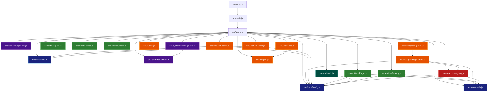

---

## 4. 游戏主循环

```mermaid
flowchart TD
    RAF[requestAnimationFrame] --> DT["Δt = min(time-last, 50ms)"]
    DT --> PAUSED{paused?}

    PAUSED -->|Yes| RENDER
    PAUSED -->|No| UPDATE

    subgraph UPDATE["⏱ UPDATE"]
        direction TB
        ELAPSED["elapsed += dt"]
        BOSS_CHK{elapsed ≥ 270s<br/>boss未生成?}
        BOSS_CHK -->|Yes| SPAWN_BOSS["生成Boss<br/>screenFlash + shake"]
        BOSS_CHK -->|No| INPUT_PROC

        SPAWN_BOSS --> INPUT_PROC
        INPUT_PROC["getInput() → {x,y}"]
        INPUT_PROC --> P_UPDATE["player.update(dt, input)"]
        P_UPDATE --> CAM_FOLLOW["camera.follow(player)<br/>camera.update(dt)"]

        CAM_FOLLOW --> SPAWN_CHK["spawnTimer -= dt"]
        SPAWN_CHK --> ENEMY_SPAWN["生成敌人<br/>getSpawnRate(elapsed)"]
        ENEMY_SPAWN --> CHEST_SPAWN["宝箱生成检查"]

        CHEST_SPAWN --> ENEMY_UPD["敌人.update(dt, player)"]
        ENEMY_UPD --> COLLISION["碰撞检测<br/>玩家vs敌人 / 子弹vs敌人"]
        COLLISION --> WEAPON_UPD["武器.update(dt, enemies)"]
        WEAPON_UPD --> BULLET_UPD["子弹.update(dt)"]
        BULLET_UPD --> GEM_UPD["宝石拾取 + 经验<br/>升级检查"]
        GEM_UPD --> FOOD_UPD["食物拾取"]
    end

    subgraph RENDER["🎨 RENDER"]
        direction TB
        CLEAR["清屏 #1a1a2e"]
        CLEAR --> GROUND["地图网格"]
        GROUND --> DROPS["宝石/食物/宝箱"]
        DROPS --> ENEMIES["敌人 + 状态特效"]
        ENEMIES --> PLAYER_DRAW["玩家 + Dash残影"]
        PLAYER_DRAW --> WEAPON_FX["武器视觉"]
        WEAPON_FX --> BULLETS["子弹"]
        BULLETS --> DMG_TXT["伤害数字"]
        DMG_TXT --> SCREEN_FX["屏幕闪光/震动"]
        SCREEN_FX --> HUD_DRAW["HUD绘制"]
    end

    UPDATE --> RENDER
    RENDER --> RAF
```

---

## 5. 游戏状态机

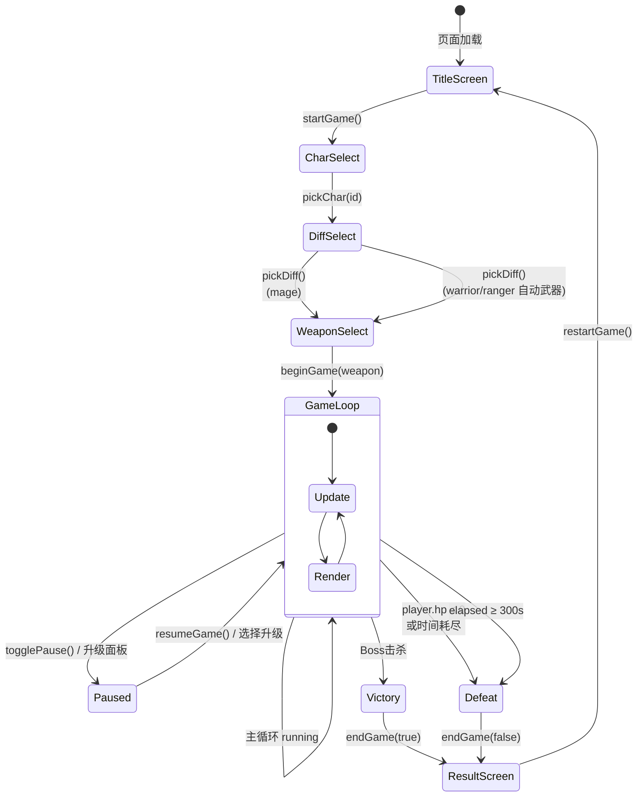

---

## 6. 数据流

### 6.1 升级数据流

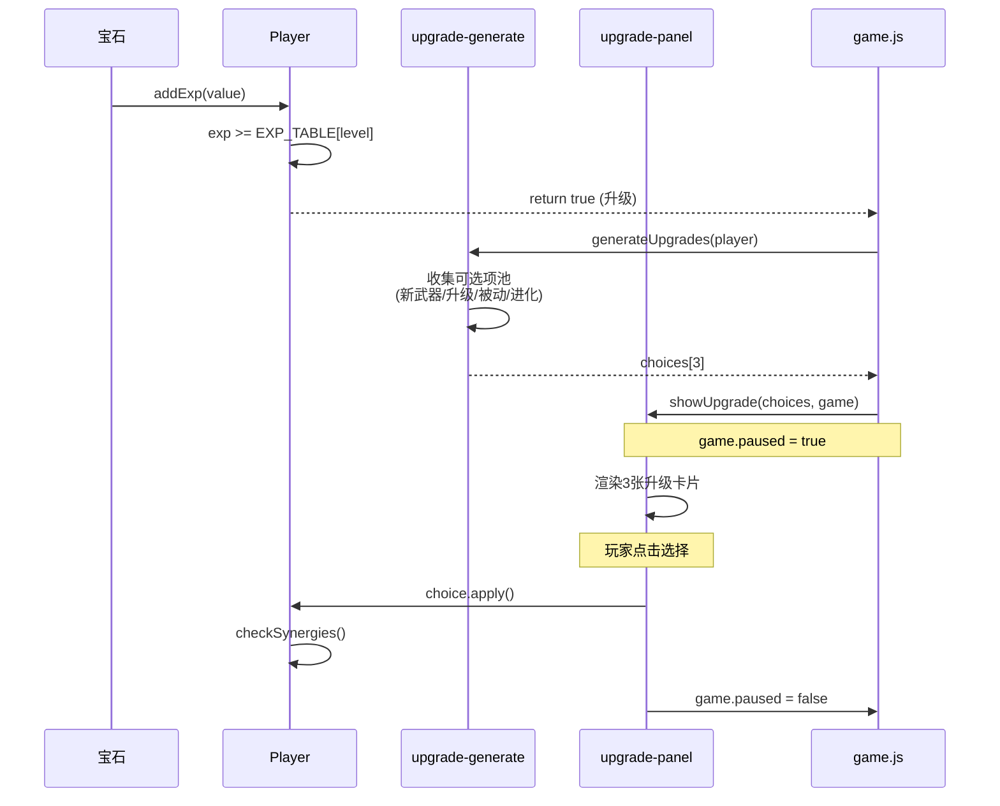

### 6.2 伤害数据流

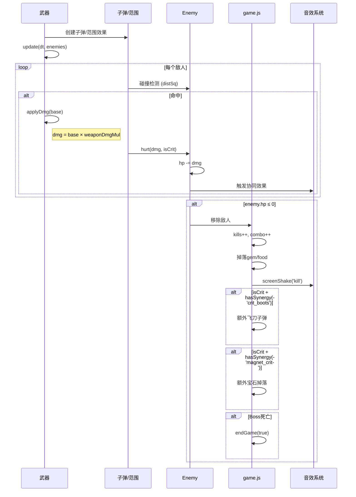

### 6.3 存档数据流

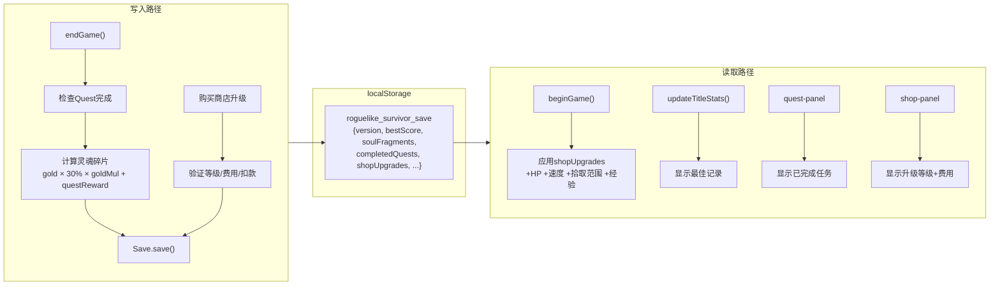

---

## 7. 类图

### 7.1 实体类

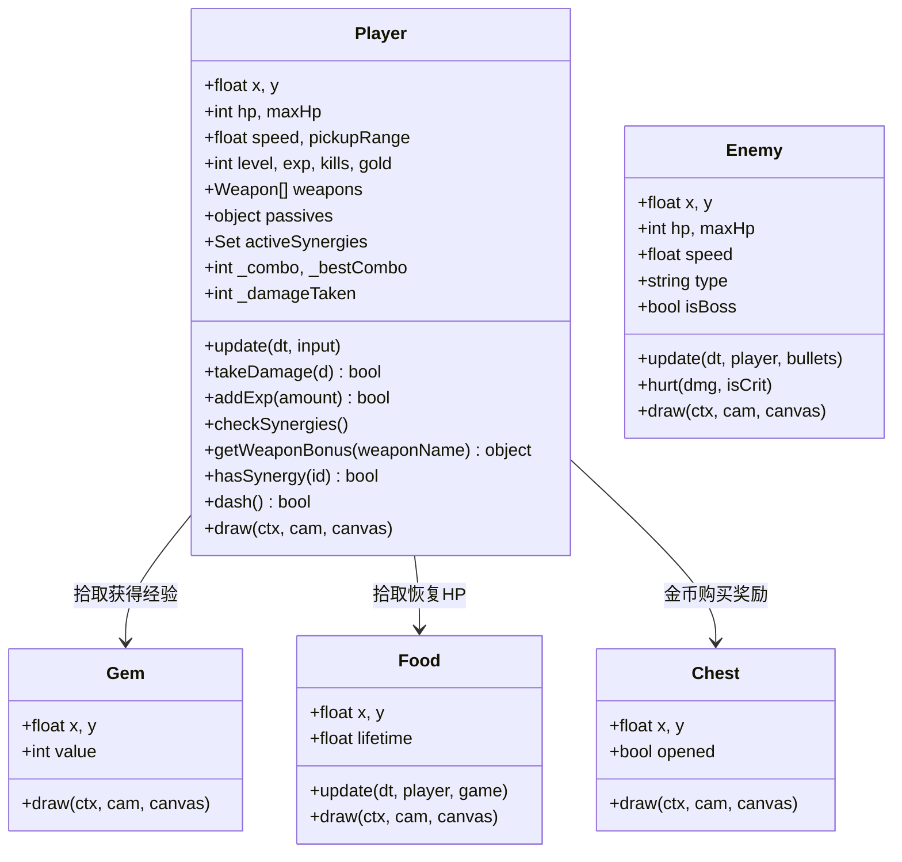

### 7.2 武器类层次

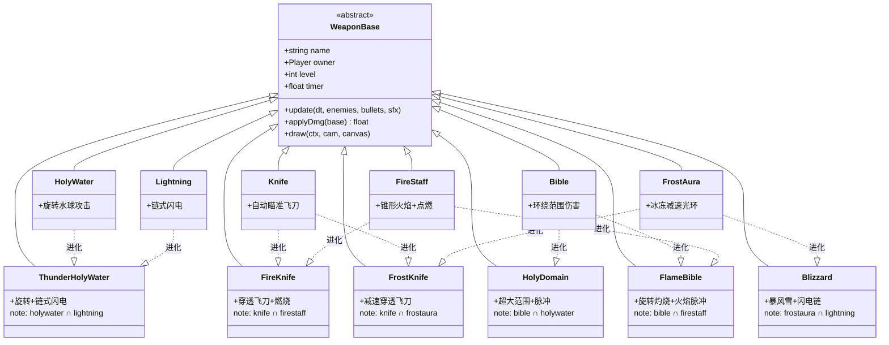

---

## 8. UI场景流转

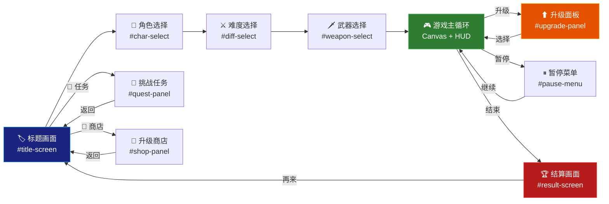

---

## 9. 系统架构

### 9.1 协同系统

```mermaid
graph LR
    subgraph 被动×被动
        CR["crit + speedboots<br/>🔪 风之锋刃"] --> CK["暴击→飞刀"]
        AM["armor + maxhp<br/>🛡 铁壁之心"] --> AD["护甲翻倍"]
        MC["magnet + crit<br/>💎 贪婪之魂"] --> BG["暴击→额外宝石"]
        BR["speedboots + regen<br/>🏃 生命奔流"] --> MR["移动再生×2"]
        AR["armor + regen<br/>💪 钢铁堡垒"] --> LA["低HP护甲+3"]
        MM["magnet + maxhp<br/>🔮 命运齿轮"] --> GH["宝石2%回血"]
    end

    subgraph 武器×被动
        HW["holywater+maxhp<br/>⛪ 圣水膨胀"] --> RB["半径+30%"]
        KN["knife+crit<br/>🗡 致命飞刀"] --> CC["可暴击"]
        LM["lightning+magnet<br/>⚡ 过载闪电"] --> EC["链+1 射程+50"]
        BB["bible+speedboots<br/>🔥 烈焰圣经"] --> SR["速度×1.5 范围+20"]
        FA["firestaff+armor<br/>🌋 熔岩法杖"] --> CB["锥形+40px 点燃+1s"]
        FR["frostaura+regen<br/>❄️ 极寒光环"] --> FF["冰冻+5%/s +0.5s"]
    end
```

### 9.2 出兵节奏

```mermaid
gantt
    title 出兵节奏（300秒）
    dateFormat X
    axisFormat %s秒

    section 僵尸
    生成   :0, 300

    section 蝙蝠
    生成   :60, 300

    section 骷髅+幽灵
    生成   :120, 300

    section 精英+分裂虫
    生成   :180, 300

    section Boss
    生成   :270, 300
```

---

## 10. 性能架构

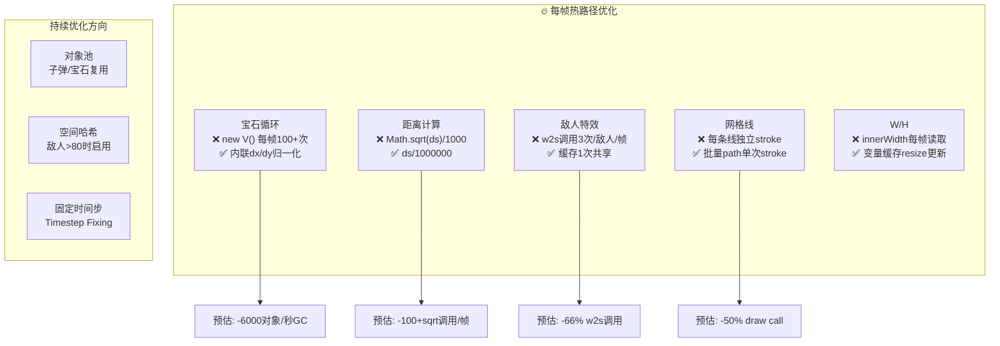

---

## 11. 架构决策记录

| # | 日期 | 决策 | 原因 | 替代方案 |
|---|------|------|------|---------|
| ADR-1 | 04-02 | 单HTML文件起步 | 快速原型，零依赖 | 直接模块化 |
| ADR-2 | 04-04 | ES Module拆分 | 2633行→20模块 | Webpack打包 |
| ADR-3 | 04-04 | window.game全局 | E2E测试+跨模块通信 | 依赖注入 |
| ADR-4 | 04-04 | Canvas HUD | 避免DOM/Canvas混合 | DOM HUD |
| ADR-5 | 04-04 | HTML overlay面板 | 复用CSS，一致性好 | 全Canvas UI |
| ADR-6 | 04-04 | localStorage | H5标准方案 | IndexedDB |
| ADR-7 | 04-04 | Playwright E2E | 无需导出函数 | Jest单元测试 |
| ADR-8 | 04-05 | 内联数学替代new V() | 消除热路径GC | 对象池 |

---

## 12. 架构迭代规则

每次涉及以下变更时，**必须同步更新本文档对应章节**：

| 变更类型 | 更新章节 | 示例 |
|---------|---------|------|
| 新增/删除模块 | §2 目录结构 + §3 依赖图 | 新增 src/core/pool.js |
| 修改模块依赖 | §3 依赖图 + §5 数据流 | weapon拆分为独立文件 |
| 新增/修改系统 | §9 系统架构 | 新增协同类型 |
| 修改游戏流程 | §4 主循环 + §6 状态机 | 新增中间结算画面 |
| UI场景变更 | §8 UI流转 | 新增设置面板 |
| 性能架构调整 | §10 性能架构 | 引入对象池 |
| 技术决策 | §11 决策记录 | 替换存储方案 |
